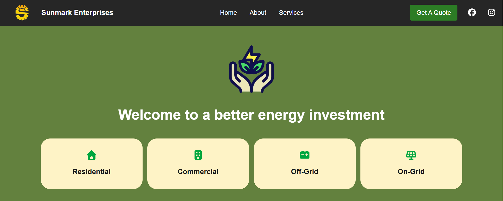
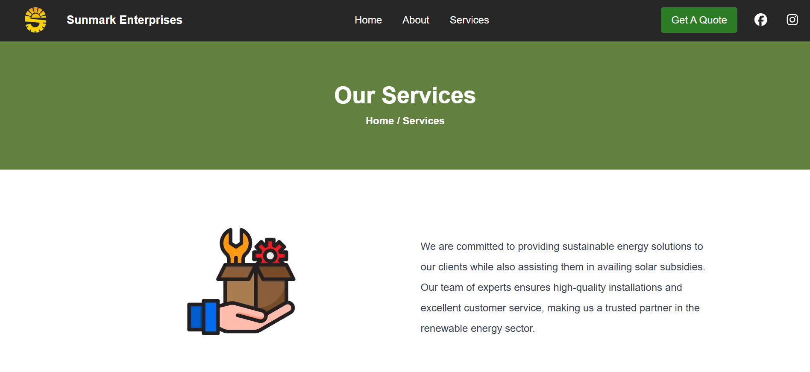
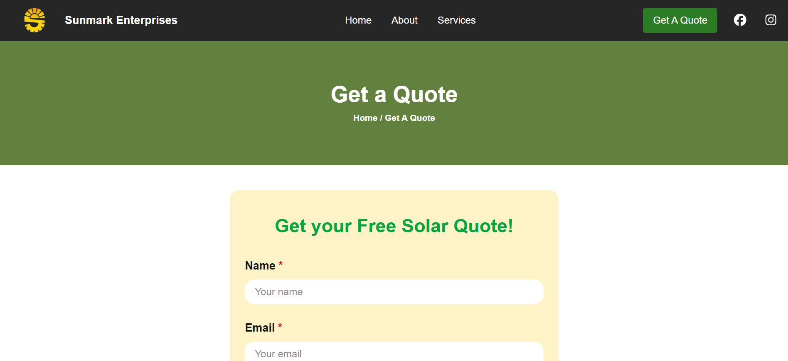

# SunMark Enterprises
A full stack business portfolio website for a solar installers businesses, showing business details. Provide a admin portal for queries raised by customers.
---
## Preview




---
## Live Demo

Sunmark Enterpises: https://sunmarkenterprises-solar-solutions.vercel.app
---
## Features

- Responsive UI
- REST API Integration
- CRUD Operations
- Admin Dashboard
- Backend Integration for Form
---
## Tech Stack

### Frontend
- Next.js
- Tailwind CSS
- Javascript

### Backend
- Next.js API Routes
- REST APIs

### Database
- MongoDB
- Mongoose

### Authentication
- JWT Authentication
  
### Deployment
- Vercel
- Render
---
## Folder Structure


```bash
project/
│
├── public/
│   └── logo.png
│
├── src/
│   │
│   ├── app/
│   │   │
│   │   ├── api/
│   │   │   ├── auth/
│   │   │   │   └── route.js
│   │   │   │
│   │   │   ├── contact/
│   │   │   │   └── route.js
│   │   │   │
│   │   │   └── admin/
│   │   │       └── stats/
│   │   │           └── route.js
│   │   │
│   │   ├── admin/
│   │   │   ├── consumerquote/
│   │   │   │   └── page.jsx
│   │   │   ├── login/
│   │   │   │   └── page.jsx
│   │   │   ├── AdminDashboard.jsx
│   │   │   ├── layout.jsx
│   │   │   └── page.jsx
│   │   │
│   │   ├── about/
│   │   │   └── page.jsx
│   │   │
│   │   ├── contactform/
│   │   │   └── page.jsx
│   │   │
│   │   ├── services/
│   │   │   └── page.jsx
│   │   │
│   │   ├── globals.css
│   │   ├── layout.jsx
│   │   └── page.jsx
│   │
│   ├── components/
│   │   ├── Navbar.jsx
│   │   ├── Footer.jsx
│   │   │
│   │   └── adminComponents/
│   │       ├── FootAdmin.jsx
│   │       └── NavAdmin.jsx
│   │
│   ├── lib/
│   │   ├── models/
│   │   │   └── consumerquote.js
│   │   │
│   │   ├── constants/
│   │   │   └── constants.js
│   │   │
│   │   └── config/
│   │       └── db_quote.js
│
├── screenshots/
│   ├── homepage.png
│   ├── services.png
│   ├── contact.png
│   └── about.png
│
├── .env
├── .gitignore
├── .prettierignore
├── .prettierrc
├── jsconfig.json
├── next.config.js
├── package.json
├── README.md
└── tailwind.config.js
```
---
## Installation

Clone the repository

```bash
git clone https://github.com/singhcodes25/SunmarkEnterprises.git
```

### Install Dependencies

cd sunmarkenterprises

### Run the project

npm run dev


---

## Environment Variables

Very important in professional projects.

```md
## Environment Variables

Create a `.env` file in server folder and add:
```
```env
MONGO_URI=your_mongodb_url
```
---

## What I Learned

- Learning Frontend responsive
- Building REST APIs
- JWT Authentication
- Deployment on Vercel & Render
- Error Handling

---
## Future Improvements

- Add notifications
- Add dark mode
- Improve performance
---
## Author

Prem Singh

GitHub: [https://github.com/singhcodes25] 
<br>
LinkedIn: [https://linkedin.com/in/https://www.linkedin.com/in/prem-singh-shingari-367287346]
